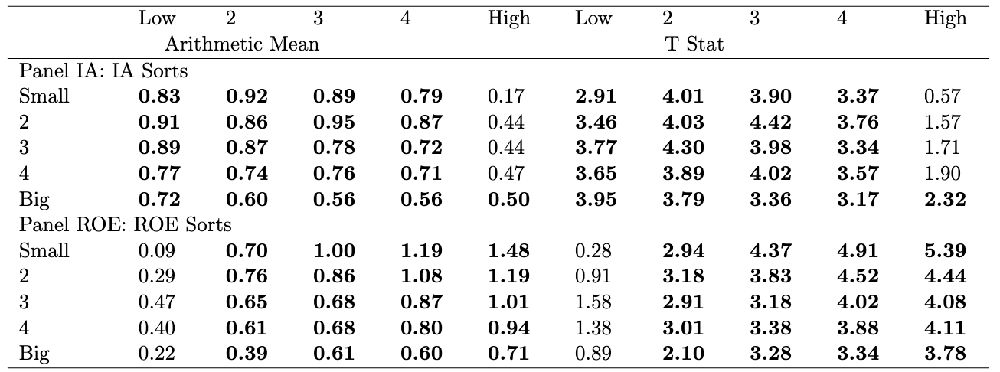
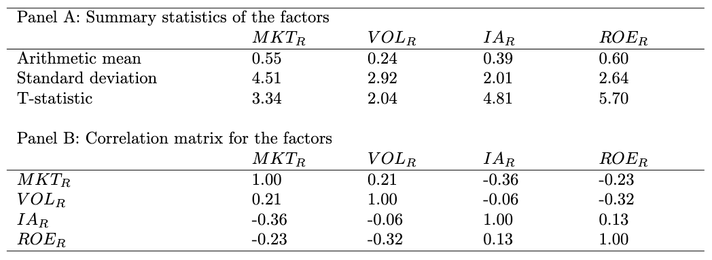
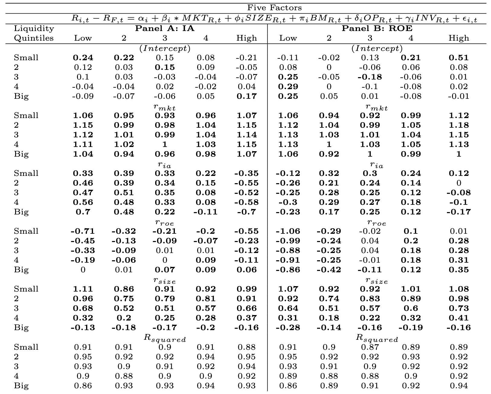
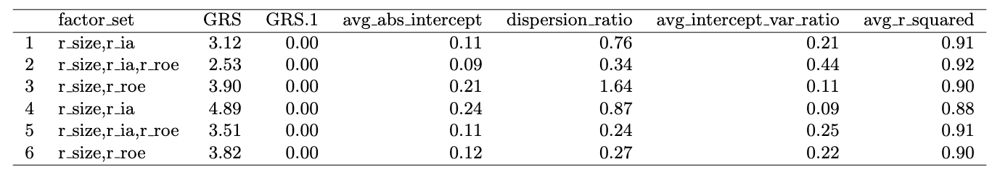

# q-Factor Model Reproduction

This repository contains a reproduction of the q-Factor model, a well-known asset pricing model used in finance. The q-Factor model aims to explain the cross-section of stock returns based on several key factors derived from firm characteristics，such as Company Size, Return on Equity (ROE) and Annual Investments (IA).

## Overview

The q-Factor model extends the traditional Fama-French factor models by introducing new factors that are believed to better capture the variations in expected returns. This repository includes code for:
- Data preparation and processing.
- Construction of the q-Factor model.
- Replication of the empirical tests and results.
- Replacement of Size with Dollar Volume within the q-Factor model.

## Repository Structure

- `data/`: This folder is not included as it's from CRSP & Compustat.
- `./`: Contains the main scripts for model construction and analysis.
- `tables/`: Contains code for generating tables for evaluation.
- `README.md`: This file.

## Installation

This repository is not designed to be run directly after cloning, as the data folder is not present. It's more of an exhibition of my work. Access to CRSP database is required to download the data. Then either refer to the original paper by Hou, Xue, and Zhang, or send me an email to get the specifics of the data items.

With the data folder, the order in which the code should be run is:

1. roe_ia.R
2. portfolio_step1.R
3. portfolio_step2.R
4. Factors.R
5. factor_comparison.R

## Results

I have made the following tables to evaluate the performance of the replicated model.

This table below shows the value-weighted returns on 5 by 5 sorts.

This table below shows the distribution stats on the return factors.

This table below shows the regression of 5 by 5 returns (y) on return factors (X).

This table below shows the GRS stats and other stats.

